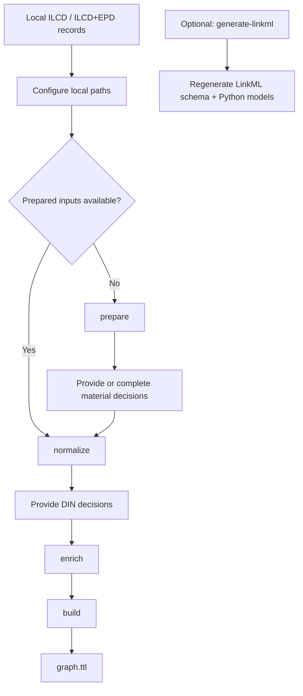

# FBI 2026 semantic LCA harmonization

Environmental product records from different repositories use different classifications, property names, and data structures. This Python package harmonizes ILCD/ILCD+EPD records into an RDF knowledge graph with shared material, planning, and property concepts, while retaining each record's UUID, source repository, and source classifications.

This repository accompanies the Forum Bauinformatik 2026 paper **“Harmonizing and Querying Fragmented Environmental Data Repositories for Early-Phase Building Design”**. The package implements its semantic harmonization pipeline using ready-mix concrete records from ÖKOBAUDAT, IBU.data, EPDNorge, and the International EPD System (IES).

## Pipeline



1. **Normalize and select records.** Apply repository-specific handling and identify ready-mix concrete through source classifications, deterministic material rules, and precomputed category decisions.
2. **Enrich semantics.** Align materials to the ÖKOBAUDAT taxonomy and associate DIN 276 potential application contexts. Include BKI links through DIN when configured.
3. **Construct the graph.** Transform JSON through LinkML, create RDF identifiers, and link records to shared SKOS concepts.
4. **Classify properties.** Execute SHACL rules for strength and density classes and serialize the harmonized graph as Turtle.

The repository focuses on semantic harmonization and graph construction. A [small SPARQL example](src/ilcd_harmonizer/resources/example.rq) illustrates cross-repository access to the resulting graph. See [the pipeline method](docs/pipeline.md) for the selection rules and graph structure.

## Installation

Create and activate the Conda environment:

```console
conda env create -f environment.yml
conda activate fbi-2026-lca
```

The environment lists the runtime pins from `pyproject.toml` and installs the package. Alternatively, use a Python 3.12 virtual environment:

```console
python -m venv .venv
# Activate .venv using your shell's activation command.
python -m pip install -e .
```

## Inputs and configuration

Supply local ILCD/ILCD+EPD JSONL records, the external ÖKOBAUDAT taxonomy and DIN vocabulary, and UUID-keyed material/DIN decisions for semantic enrichment. Deterministic IES categorization can run directly on prepared material fields. BKI resources are optional.

Copy [config.example.yaml](config.example.yaml) to `config.local.yaml`, keep the source entries you use, and replace the placeholder paths with your local files. The template contains no source records or semantic decisions. Relative paths resolve beside the configuration file. Keep runtime configurations and research inputs local.

`input.sources` identifies the repository records and source URIs. `material_decisions` and optional `material_rules` supply material categories; `din_decisions` supplies planning assignments. `resources` locates the required English/German taxonomy and DIN vocabulary, an optional separate normalization hierarchy, and optional BKI files. `output_dir` receives preparation artifacts and pipeline outputs. [Input data](docs/input-data.md) explains the configuration keys, formats, and stage requirements.

## Run

With prepared inputs and complete material/DIN decisions, configure the local paths and run:

```console
ilcd-harmonizer run --config CONFIG_FILE
```

Starting with compatible local repository records, prepare IES fields where needed, then provide or complete material decisions before normalization:

```console
ilcd-harmonizer prepare --config CONFIG_FILE
```

`prepare` extracts eligible IES material fields into `output_dir/ies-material-fields.csv`. Enable `material_rules` in your local configuration with that file's path to use deterministic categorization. Preparation requires only configured IES records and an output directory; it does not load decisions or external vocabularies. Skip it when using existing prepared fields or precomputed material decisions.

Continue in stages:

```console
ilcd-harmonizer normalize --config CONFIG_FILE
```

Supply UUID-keyed DIN decisions for the selected records in `normalized.jsonl`, then run:

```console
ilcd-harmonizer enrich --config CONFIG_FILE
ilcd-harmonizer build --config CONFIG_FILE
```

`run` executes `normalize`, `enrich`, and `build` in order; preparation is a separate optional step. Use the same configuration for the individual stages. `ilcd-harmonizer diagnose --config CONFIG_FILE` produces source diagnostics. `python -m ilcd_harmonizer` exposes the same commands. Model-assisted material and DIN assignments are consumed as precomputed UUID-keyed decisions. This package makes no model API calls and does not require users to reproduce model-assisted decision generation.

Regenerate the merged LinkML schema and Python models from the packaged modular schemas with `ilcd-harmonizer generate-linkml`. This command requires no runtime configuration or research inputs.

## Outputs

The configured output directory contains:

| File | Contents |
|---|---|
| `ies-material-fields.csv` | Local deterministic material-rule input produced only by `prepare`. |
| `graph.ttl` | Harmonized RDF graph, including source identifiers and semantic links. |
| `normalized.jsonl` | Selected, normalized source records. |
| `enriched.jsonl` | Normalized records with DIN context assignments. |
| `normalization-report.json` | Per-record acceptance and selection reasons. |
| `shacl-report.ttl` | SHACL report, separate from the data graph. |
| `run-summary.json` | Input/output counts, repository counts, property-class coverage, and conformance status. |
| `diagnostics.json` | Source/property/module counts produced by `diagnose`. |

## Paper, data availability, and citation

<!-- Add the paper DOI here when available. -->

This implementation accompanies the FBI 2026 paper's contribution: a shared semantic representation that supports querying across heterogeneous environmental-data repositories. DIN assignments express potential application contexts.

The source environmental records and some external semantic resources used in the study are subject to their respective licenses and are not redistributed in this repository. The pipeline operates on compatible local inputs supplied by the user.

When using the software, cite the accompanying FBI 2026 paper and identify the software version or commit. Software citation: **Georgi Tsakov (2026), _FBI 2026 semantic LCA harmonization_, version 0.1.0**, [repository](https://github.com/g3rezz/fbi-2026-semantic-lca-harmonization).

Code is licensed under the [MIT license](LICENSE.md). Packaged schemas and generated models retain their CC-BY-4.0 notices; see [NOTICE](NOTICE) for attribution.
